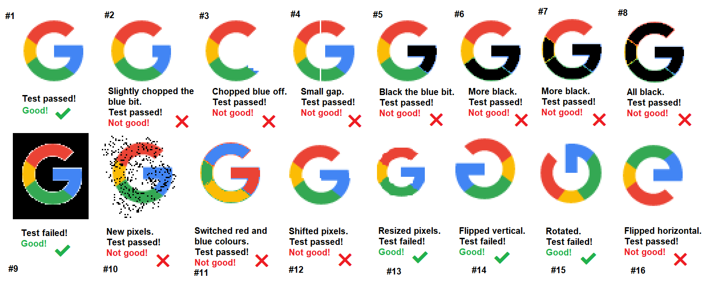

# Google G Logo SVG variations

One day I found a post:

- https://forum.katalon.com/t/verify-image-present-accuracy/67129

This included a set of Google G Logo variations:



I was interested in this. I wanted to create a similar set of Google G Logo variations myself.

I found that a Scalable Vector Graphics of Google G Logo is publicly available at:

- https://commons.wikimedia.org/wiki/File:Google_%22G%22_Logo.svg

I thought that I would write a set of XSLT stylesheets that takes the original SVG file as input, outputs transformed SVG files. Yes, I like XSLT! I respect James Clark, the originator of XSLT and XPath technologies. I did a lot of XSLT programming 10 years ago. Let me try it again.

Not only SVG to SVG transformation, I would try converting SVG images into PNG raster images.

I have developed a Java class, which drives XSLT and Apache Batik library.

- [com.kazurayam.googleglogo.GoogleGLogoConverter](src/main/java/com/kazurayam/googleglogo/GoogleGLogoConverter.java)


The `GoogleGLogoConverter` has `public static void main(String[] args)` method. You can execute it by a Gradle task:

```
$ cd <GoogleGLogoVariations project dir>
$ ./gradlew run
```

You can see the demo output at:

- 

Also there is a JUnit5 test for the class.

- [com.kazurayam.googleglogo.GoogleGLogoConverterTest](src/test/java/com/kazurayam/googleglogo/GoogleGLogoConverterTest.java)

